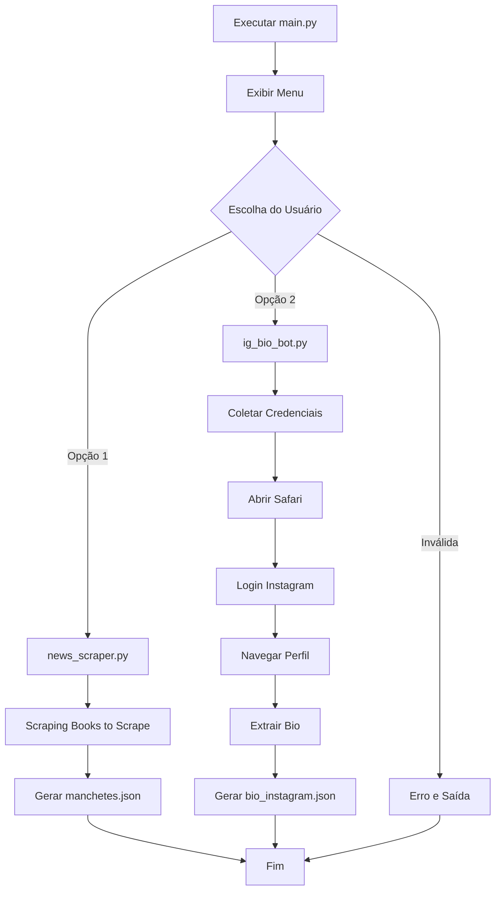

# 🐍 Projeto Python - Scraping e Instagram Bot

## 📖 Visão Geral

Este projeto é um conjunto de ferramentas Python para:
1. **Web Scraping** - Extrair informações de livros do site "Books to Scrape"
2. **Instagram Bot** - Automatizar login e extrair biografia de perfis do Instagram

## 🗂️ Estrutura do Projeto

```
faculteste.py/
├── 📄 main.py              # Arquivo principal com menu interativo
├── 📄 news_scraper.py      # Módulo para scraping de livros
├── 📄 ig_bio_bot.py        # Módulo do bot do Instagram
├── 📄 requirements.txt     # Dependências do projeto
├── 📄 README.md           # Este arquivo de documentação
├── 📁 venv/               # Ambiente virtual Python
├── 📄 bio_instagram.json  # Arquivo gerado com dados do Instagram
└── 📄 manchetes.json      # Arquivo gerado com dados dos livros
```

## 🚀 Como Executar

### 1. Preparação do Ambiente

```bash
# Navegue até o diretório do projeto
cd /Users/gttg/Downloads/Algoritmos-e-Complexidade-instagram/main.py

# Ative o ambiente virtual
source venv/bin/activate

# Execute o programa principal
python main.py
```

### 2. Menu de Opções

O programa exibirá um menu com duas opções:

```
Escolha uma opção:
1 - Scraper de Notícias (Books to Scrape)
2 - Bot Login e Scraper de Bio Instagram
Opção: 
```

## 🔧 Funcionalidades Detalhadas

### 📚 Opção 1: Scraper de Notícias

**O que faz:**
- Acessa o site http://books.toscrape.com/
- Extrai informações de todos os livros da página principal
- Para cada livro coleta: título, link e resumo
- Salva tudo no arquivo `manchetes.json`

**Tecnologias utilizadas:**
- `requests` - Para requisições HTTP
- `BeautifulSoup` - Para parsing de HTML
- `json` - Para manipulação de dados JSON

**Processo passo a passo:**
1. Faz requisição GET para a página principal
2. Localiza todos os elementos de livros
3. Para cada livro, extrai título e link
4. Acessa a página individual do livro
5. Extrai o resumo/descrição
6. Organiza tudo em formato JSON
7. Salva no arquivo `manchetes.json`

### 📱 Opção 2: Bot do Instagram

**O que faz:**
- Automatiza o navegador Safari
- Faz login no Instagram
- Navega até um perfil específico
- Extrai a biografia do perfil
- Salva no arquivo `bio_instagram.json`

**Tecnologias utilizadas:**
- `selenium` - Para automação do navegador
- `Safari WebDriver` - Navegador nativo do macOS
- `BeautifulSoup` - Para análise do HTML
- `json` - Para salvar os dados

**Processo passo a passo:**
1. Abre o navegador Safari automaticamente
2. Navega até a página de login do Instagram
3. Preenche usuário e senha automaticamente
4. Clica no botão de login
5. Aguarda o login ser processado
6. Trata popups automáticos
7. Navega até o perfil alvo
8. Extrai dados da biografia
9. Salva em arquivo JSON
10. Fecha o navegador

## 📋 Dependências

As seguintes bibliotecas são necessárias (definidas em `requirements.txt`):

```
requests         # Para requisições HTTP
beautifulsoup4   # Para parsing de HTML
selenium         # Para automação do navegador
webdriver-manager # Para gerenciar drivers automaticamente
```

## 🛠️ Configuração Técnica

### Ambiente Virtual
O projeto usa um ambiente virtual Python para isolar as dependências:
- Criado com: `python3 -m venv venv`
- Ativado com: `source venv/bin/activate`

### Safari WebDriver
Para o bot do Instagram, o Safari WebDriver foi habilitado com:
```bash
sudo safaridriver --enable
```

### Arquivos de Saída

#### `bio_instagram.json`
Estrutura do arquivo gerado pelo bot do Instagram:
```json
{
  "profile": "https://www.instagram.com/username/",
  "username": "username",
  "bio": "Biografia extraída do perfil"
}
```

#### `manchetes.json`
Estrutura do arquivo gerado pelo scraper:
```json
[
  {
    "title": "Título do Livro",
    "link": "http://books.toscrape.com/catalogue/link-do-livro/",
    "summary": "Resumo/descrição do livro"
  }
]
```

## ⚠️ Considerações Importantes

### Segurança
- **Credenciais**: Use variáveis de ambiente para armazenar credenciais
- **Rate Limiting**: O Instagram pode bloquear automação excessiva
- **Termos de Uso**: Respeite os termos de uso das plataformas

### Variáveis de Ambiente
Para maior segurança, defina suas credenciais como variáveis de ambiente:
```bash
export IG_USER="seu_usuario"
export IG_PASS="sua_senha"
```

### Tratamento de Erros
- O código inclui try/catch para lidar com elementos não encontrados
- Timeouts configurados para evitar travamentos
- Verificações de existência de elementos antes de acessá-los

## 🎯 Casos de Uso

### Para o Scraper de Livros:
- Pesquisa de mercado literário
- Análise de preços de livros
- Coleta de dados para estudos
- Monitoramento de catálogos

### Para o Bot do Instagram:
- Análise de concorrência
- Pesquisa de perfis específicos
- Coleta de dados para estudos de mercado
- Monitoramento de perfis corporativos

## 🔄 Fluxo de Execução



## 📞 Suporte

Se encontrar problemas:
1. Verifique se o ambiente virtual está ativo
2. Confirme que todas as dependências estão instaladas
3. Para o Instagram bot, verifique se o Safari WebDriver está habilitado
4. Verifique sua conexão com a internet

---

**Desenvolvido por:** Jhonatan Inacio e Gustavo Vinicius 
**Data:** 2025  
**Linguagem:** Python 3.13+  
**Plataforma:** macOS
